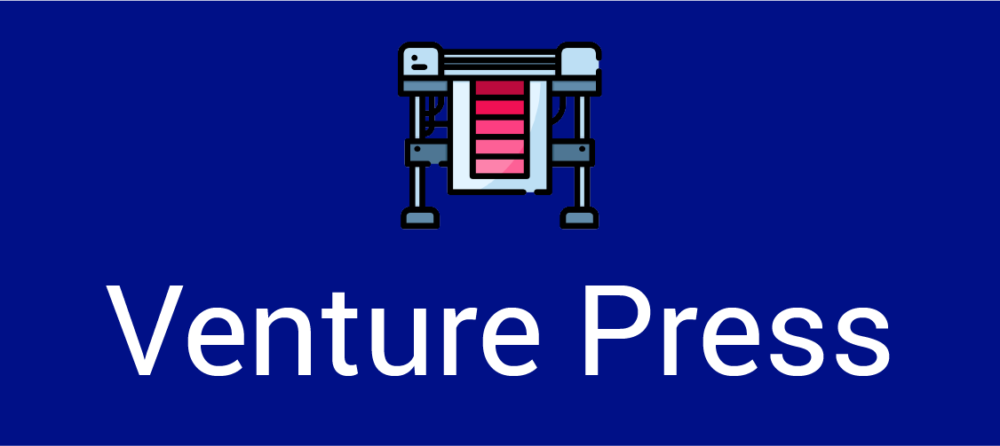
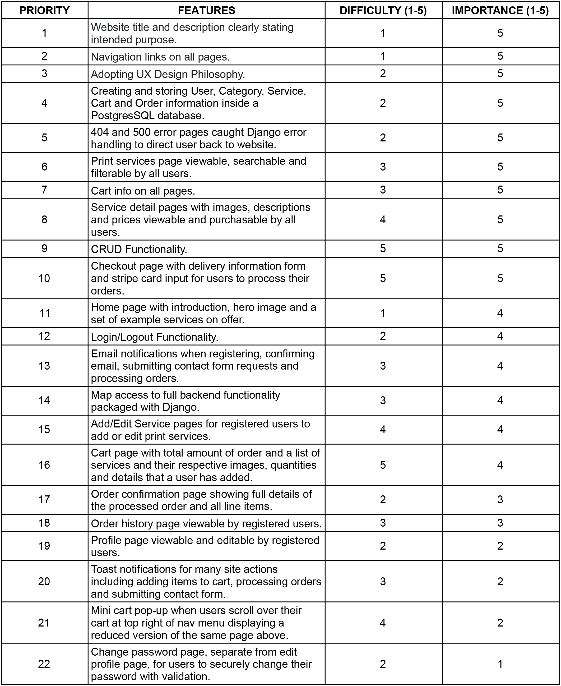
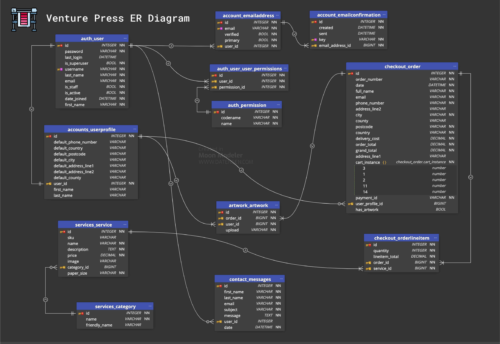

<h1 align="center">Venture-Press---Full-Stack-Frameworks-With-Django-Milestone-Project (Milestone Project #4)</h1>
<h1 align="center">Olly Lomax</h1>
<h2 align="center"></h2>

# Venture Press Website

I built this website using my knowledge of HTML5, CSS3, JavaScript, jQuery, Bootstrap, Python, PostgresSQL and Django which I have learned from Code Institute during my Diploma in Full Stack Software Development. Venture Press is an imaginary brand that I have created to showcase my knowledge and skills in the aforementioned languages and frameworks with the intention of completing my Full Stack Frameworks with Django Milestone Project.

The website’s purpose is to deliver an E-Commerce platform for a domestic printing company, offering a wide range of print services which are all purchasable through a cart and checkout flow.

View the live project [here](https://venture-press.herokuapp.com/)

## UX STRATEGY

### Goals
- To expand upon my knowledge of HTML5, CSS3, JavaScript, jQuery and Python.
- To showcase my new knowledge of Django and PostgresSQL.
- To provide a responsive website fulfilling the UX Design philosophy.
- To provide a website showcasing customisable print services for sale.
- To provide a website with means to contact the company with queries and/or custom quotations.
- To provide a website with full cart and checkout functionality for purchasing print services.
- To provide a website with user registration, profile page and order history.
- To provide a website with notification feedback through email for registration, purchases and contact form.
- To provide a website with admin functionality for adding new print services.
- To provide a website with superuser functionality for managing backend operations.

### User Stories

- As a user, I want to easily understand the purpose of the site.

- As a user, I want to clearly view the website and content on any device.

- As a user, I want to easily navigate the website so that I can find content quickly.

- As a user, I want to be able to see what print services are available and how much they are.

- As a user, I want to be able to search the website for services I may be interested in.

- As a user, I want to be able to filter the print services by category.

- As a user, I want to be able to customise my chosen service and then add it to my cart.

- As a user, I want to be able to view all services I have added to my cart before deciding whether to proceed to payment.

- As a user, I want to be able to proceed to purchasing the contents of my cart, input my card details and make the purchase.

- As a user, I want to be able to contact the company about any queries or custom quotations I might need.

- As a user, I want to be able to easily return to the website if I encounter a page error.

- As a user, I want to be able to register on the website.

- As a registered user, I want to be able to log in to my account on the website.

- As a registered user, I want to be able to log out of my account on the website.

- As a registered user, I want to be able to view my profile, edit my details and change my password.

- As a registered user, I want to be able to see a list of my order history.

- As an admin user, I want to be able to create, edit and delete print services. 

- As the superuser, I want to be able to create, edit and delete categories and services.

- As the superuser, I want to be able to create, edit and delete user details and emails.

- As the superuser, I want to be able to create, edit and delete orders.

## UX SCOPE

- ### Planned Features

    -   Creating and storing User, Category, Service, Cart and Order information inside a PostgresSQL database.
    -   Adopting UX Design Philosophy.
    -   Navigation links on all pages.
    -   Cart info on all pages.								
    -   Website title and description clearly stating intended purpose.			
    -   CRUD Functionality.							
    -   Login/Logout Functionality.	
    -   Home page with introduction, hero image and a set of example services on offer.
    -   Profile page viewable and editable by registered users.
    -   Order history page viewable by registered users.
    -   Change password page, separate from edit profile page, for users to securely change their password with validation.
    -   Print services page viewable, searchable and filterable by all users.
    -   Add/Edit Service pages for registered users to add or edit print services.
    -   Service detail pages with images, descriptions and prices viewable and purchasable by all users.
    -   Cart page with total amount of order and a list of services and their respective images, quantities and details that a user has added.
    -   Mini cart pop-up when users scroll over their cart at top right of nav menu displaying a reduced version of the same page above.
    -   Checkout page with delivery information form and stripe card input for users to process their orders.
    -   Order confirmation page showing full details of the processed order and all line items.
    -   Toast notifications for many site actions including adding items to cart, processing orders and submitting contact form.
    -   Email notifications when registering, confirming email, submitting contact form requests and processing orders.
    -   Map access to full backend functionality packaged with Django.
    -   404 and 500 error pages caught Django error handling to direct user back to website.

## UX STRUCTURE

###  User Story:
> As a user, I want to easily understand the purpose of the site.

- #### Acceptance Criteria:
    - Kitchen Craft logo displayed top left of navbar.
    - Heading at top of home page with an introduction explaining the website.
    - Cuisine of the Week recipes displayed immediately showing community content to user.

 - #### Implementation:
    The logo will be displayed at the top left of the navbar, this will be consistent throughout all pages. An h1 heading will welcome users and a paragraph below, clearly displayed in white text over a coloured background, will outline the exact purpose of the site. A background image behind the h1 header and paragraph will show kitchen related produce/utensils.

### User Story:
> As a user, I want to easily understand the purpose of the site.
- #### Acceptance Criteria:
	◦	Venture Press logo displayed top left of navbar.
	◦	Heading at top of home page over the hero image with introduction explaining the website.
	◦	Sample of Print Services available at bottom of page.
	◦	Footer including company info and social media links.
 - #### Implementation:
    The logo will be displayed at the top left of the navbar, this will be consistent throughout all pages. An h1 heading will welcome users and a paragraph below, clearly displayed in white text over the hero image, will outline the exact purpose of the site. The hero image will show print related vectors of machinery and colour spectrum.Some sample Print Services will be rendered at the bottom of the Home page which will be a filtered version of the services collection. These will be filtered at random.

### User Story:
> As a user, I want to clearly view the website and content on any device.
- #### Acceptance Criteria:
	◦	The layout of the website is well structured, clearly readable and aesthetically pleasing.
	◦	Across all viewports and devices.
 - #### Implementation:
    Utilising rows and columns within Bootstrap frameworks and mobile first design will be used when coding the project and testing will be required to ensure the layout is clear on all devices. No elements should overlap their containers and all items should be responsive so that no elements are too large to display properly. Media will scale to fit all screen sizes with no stretch or distortion.

### User Story:
> As a user, I want to easily navigate the website so that I can find content quickly.
- #### Acceptance Criteria:
	◦	Logo will link to home page on all pages.
	◦	Navigation menu will be displayed on all pages.
	◦	All navigation links will direct to the correct pages.
 - #### Implementation:
    For an unregistered user, the navigation menu will consist of:

	- Home - home.html
	    - Services dropdown menu consisting of:-
	    - Stationery - filtered services.html
	    - Advertising - filtered services.html
	    - Miscellaneous - filtered services.html
-   - All Services - services.html
	- Contact - contact.html
	- Register - register.html
	- Login - login.html
	- Cart - cart.html
	- Mini-Cart interactive popup on Cart hover - mini_cart.html

	•	For a registered user, the navigation menu will consist of:
	◦-  ome - home.html
	-   Services dropdown menu consisting of:-
	    -   Stationery - filtered services.html
	    -   Advertising - filtered services.html
	    -   Miscellaneous - filtered services.html
	    -   All Services - services.html
	-   Contact - contact.html
	-   Account dropdown menu consisting of:-
	    -   Profile - profile.html
        -   Order History - order_history.html
	    -   Message Centre - messages.html
        -   Artwork Upload - artwork.html
        -   Change Password - password_chan-    .html
	    -   Log Out - directs to home.html
	-   Cart - cart.html
	-   Mini-Cart interactive popup on Cart hover - mini_cart.html

	•	For an admin user, the navigation menu will consist of:
	-   Home - home.html
	    -   Services dropdown menu consisting of:-
	    -   Stationery - filtered services.html
	    -   Advertising - filtered services.html
	    -   Miscellaneous - filtered services.html
	    -   All Services - services.html
	-   Contact - contact.html
	-   Account dropdown menu consisting of:-
	    -   Profile - profile.html
        -   Order History - order_history.html
	    -   Message Centre - messages.html
        -   Artwork Upload - artwork.html
        -   Change Password - password_chan-    .html
        - Add Print Service - add_service.html
	    -   Log Out - directs to home.html
	    - Cart - cart.html
	    - Mini-Cart interactive popup on Cart hover - mini_cart.html

	•	For the Superuser account, there is full backend functionality via the /admin/ route.
	•	The navigation menu will be visible on all pages. Each navigation item will direct the user to the applicable page. For smaller devices the menu will collapse into a burger menu. When clicked, this menu will expand downwards displaying the same navigation items. Clicking away from this menu will close it.
### User Story:
> As a user, I want to be able to see what print services are available and how much they are.
- #### Acceptance Criteria:
	◦	Services page will be created.
	◦	Services images displayed and scaled to fit all screen sizes with no distortion.
	◦	Service descriptions clearly outlining service benefits
	◦	Service prices stand out
 - #### Implementation:
    Product images will be selected of sufficient dots per inch to clearly show the print service without loss of quality. Descriptions to be thorough enough to encourage sales and prices displayed in both a larger font size and weight.

### User Story:
> As a user, I want to be able to search the website for services I may be interested in.
- #### Acceptance Criteria:
	◦	A search bar will be displayed in the navigation bar at the top of the screen.
	◦	Placeholder text and a search button will indicate a user is able to filter services by their query.
 - #### Implementation:
    An indexing view will be created allowing users to search by the categories and services databases. When a user types in search criteria and presses the search button (or presses enter) it will return a filtered list of services based upon that criteria.

### User Story:
> As a user, I want to be able to filter the print services by category.
- #### Acceptance Criteria:
	- - Print Service categories will be listed in the dropdown of the Services navigation link as below:-
	-   Services dropdown menu consisting of:-
	    -   Stationery - filtered services.html
	    -   Advertising - filtered services.html
	    -   Miscellaneous - filtered services.html
	    -   All Services - services.html
	-   Clicking on the applicable category will filter the services by that category.
 - #### Implementation:- 
    An indexing view will be expanded upon allowing users to filter the Services database by their categories. When a user clicks the applicable category in the Services dropdown menu, it will return a filtered list of services based upon the category clicked.

### User Story:
> As a user, I want to be able to customise my chosen service and then add it to my cart.
- #### Acceptance Criteria:
	- Service detail pages will be created.
	- These will be accessible through clicking on the applicable Service on the Services page.
	- Each page will show the respective service details and various options:-
	    - Quantity input field.
	    - Select box for Paper Type.
	    - Select box for Paper Size.
	    - Select box for Print Process.
	    - Add to Cart button at the bottom.
	    - Clicking on the Add to Cart button will add this instance of the product with applicable choices to the session cart.
 - #### Implementation:- 
    Each service will be mapped to their applicable service details page through a primary key. On each page the user will be able to customise their service and add an instance of their choices to the cart which can subsequently be purchased.
	•	

### User Story:
> As a user, I want to be able to view all services I have added to my cart before deciding whether to proceed to payment.
- #### Acceptance Criteria:
	- Cart page will be created.
	- This page will be accessible by clicking on the Cart nav link, on the View Cart link on mini cart popup, or automatically when adding a service to the cart.
	- Page will display all services added and their respective customisations and quantities.
	- Quantities will be adjustable in the cart.
	- It will be possible to completely remove the service from the cart.
	- Proceed to Checkout button at bottom will direct user to payment.
	- Back to Services button will direct user back to Services page.
 - #### Implementation:- 
    This page will output the session cart to the template, listing all services added and including all the details necessary before the user makes the choice of whether to checkout or not. Removal of services and quantity adjustments will be made possible on this page itself via javascript. Once a user is happy to proceed, there will be a Checkout button or if not, a Back to Services button.

### User Story:
> As a user, I want to be able to proceed to purchasing the contents of my cart, input my card details and make the purchase.
- #### Acceptance Criteria:
	- Checkout page will be created.
	- This page will be accessible by clicking on the Proceed to Checkout nav link on the Cart page.
	- Page will display all services added and their respective customisations and quantities.
	- Page will contain a form for which the user will be required to input delivery information.
	- Page will contain a second form for Stripe payments for which the user will be required to input payment details.
	- Process Payment button will be created to initiate the order submission.
	- Back to Cart button will be created to return to the Cart page.
	- Upon successful payment, the user will be directed to an Order Summary page containing the reference details of the order.
 - #### Implementation:- 
    The Cart page will be linked to the Checkout page via a Proceed to Checkout button, at which point the details/quantities of the services are no longer editable. The same service details are displayed on this page as the Cart page, so the user will know the exact breakdown of the order before initiating payment. Two forms, one for delivery information and the other for Stripe payments will require input from the user. There will also be a Save Delivery Details button which will save the user time inputting delivery information again for the next order. Once the Process Payment button is clicked, the Stripe integration will process the payment intent with webhooks for redundancy, and if successful, direct to an order summary page referencing the details of the order. If there are errors with the payment, they will be displayed via the toast messages. An email confirmation containing this same information will be sent to the user’s email address.

### User Story:
> As a user, I want to be able to contact the company about any queries or custom quotations I might need.
- #### Acceptance Criteria:
	- Contact page will be created.
	- This page will be accessible by clicking on the Contact nav link on the main navigation bar.
	- Page will display a contact form requiring input from the user.
	- Submit Query button will be positioned below the form for users to click on when ready.
	- When the form is submitted a toast success message will show.
	- When the form is submitted an email will be sent indicated predicted response time.
 - #### Implementation:- 
    The Contact page will be accessed by navigation link inside the fixed navigation bar at the top of every page. The page itself will consist of a contact form requiring input from the user before submission of the query by clicking on a Submit Query button. Both a toast success message and a confirmation email will be initiated when the form is submitted by the user. The email will be sent to the email address in the required email input field.

### User Story:
> As a user, I want to be able to easily return to the website if I encounter a page error
- #### Acceptance Criteria:
	- 404 page will be created.
	- 500 page will be created.
	- Both pages will provide error information and a way back to the website.
 - #### Implementation:- 
    Error handling will be used to catch both 404 and 500 page errors and direct the user to the respective page. This will inform them in detail of the error in question and a link will be provided directing back to the home page.

### User Story:
> As a user, I want to be able to register on the website.
- #### Acceptance Criteria:
	- A Signup page will be created.
	- An email address, username and password will be required input fields from the user.
	- An email confirmation email will be sent to the user when the form is submitted.
	- When a user clicks on the link in the sent email, they will be directed to a confirm-email page to verify their email.
	- An information toast will show indicating an email has been sent to the email address.
	- When a user visits the link in the sent email, they will be directed to a page with a Confirm email address button.
	- When a user clicks on the Confirm button, they will directed back to the login page and a toast success message will show.
 - #### Implementation:- 
    Using Django allauth, the Signup form will capture the username, password and email which when submitted will add a user account to the Users database assuming one does not already exist using an identical email and/or username. Each input field will have its own validation including but not limited to; minimum and maximum character limits, character requirements and regular expressions. There will also be confirm email and confirm password fields as extra validation for the user's protection. When a successful form is submitted, a toast message will show and an email will be sent requiring email verification. When the link in the email is clicked, user is directed to the a unique confirm-email page where they can confirm their account by clicking on the Confirm button. Upon a successful verification a toast success message will appear and the the user will be directed back to the login page.

### User Story:
> As a registered user, I want to be able to log in to my account on the website.
- #### Acceptance Criteria:
	- A Login page will be created.
	- An email address OR username, and password inputs will be required by the user.
	- Password will be checked against the email OR username input for an account in the Users database.
	- If the details input match those of a valid user account, then a user session is initiated.
 - #### Implementation:- 
    Using Django allauth, the Login form will capture the username, password and email which when submitted will search for a user account in the Users database matching both inputs. Each input field will have its own validation including but not limited to; minimum and maximum character limits, character requirements and regular expressions. When a successful form is submitted, a user session will be initiated and a toast message will show a successful login and the user will be directed to the home page.

### User Story:
> As a registered user, I want to be able to log out of my account on the website.
- #### Acceptance Criteria:
	- A Logout page will be created.
	- User will be asked if they are sure about logging out.
	- Cancel button will be created for cancelling log out.
	- Sign Out button will be created to log out of account.
	- A toast success message will be displayed on successful log out.
 - #### Implementation:- 
    Using Django allauth, the Logout form will check whether the user wants to log out of their account or not. If they click on the Cancel button then they will be directed back to the home page. If they click on the Sign Out button then the user session will be deleted, a toast success message will appear and they will be subsequently directed back to the home page.

### User Story:
> As a registered user, I want to be able to view my profile, edit my details and change my password.
- #### Acceptance Criteria:
	- Profile page will be created.
	- Edit profile page will be created.
	- Change password page will be created.
	- Buttons on the profile page will be displayed to edit profile and/or change password which will link to their respective pages.
	- An Order History and Sign Out button will be underneath the form.
 - #### Implementation:- 
    A Profile page containing a form with new fields including First and Last name as well as delivery details will be shown. These fields will be empty by default as they were not required upon registration. The Edit Profile button will link to the respective page where the user can edit First Name, Last Name and Delivery information. Username changes are not permitted. The Change Password button will direct to the respective page where the user can edit their password. This will have the same validation and confirmation field as the registration page. Upon successful edits of profile or password, a toast message will let the user know if it was successful. A cancel button will also be included on each form to return to the profile page. An Order History button will be displayed which will direct the user to the Order History page. Finally, a Sign Out button will be displayed on the profile page which will terminate the session and return the user to the login page with a successful log out toast message.

### User Story:
> As a registered user, I want to be able to see a list of my order history.
- #### Acceptance Criteria:
	- Order History page will be created.
	- A table showing the user’s list of orders will be displayed.
	- Order Number, Date, Line Items and Total will be shown in the table.
	- Order Number will be an anchor linking to an Order Details page specific to that order.
	- A Back to Profile button will be underneath the table.
 - #### Implementation:- 
    The order history page will contain an iterated list of all past order submissions from the user in tabular format. The table will show the Order Number, Date, Line Items and the Total for every past order. The Order number itself in each table row will be an anchor linking to the pertaining Order Details page which will outline the order in more detail including Delivery and Billing information and charges. A Back to Profile button will be created beneath this table which when clicked, will direct the user back to their Profile page.

### User Story:
> As an admin user, I want to be able to create, edit and delete print services. 
- #### Acceptance Criteria:
	- Add Service page will be created.
	- Edit Service page will be created.
	- Edit and Delete buttons will be shown on every Service on the Services page, and on every Service Details page.
	- Clicking on any Delete button will initiate a dialog popup asking the admin user to confirm deletion.
	- Confirm Deletion and Cancel buttons will be displayed on the dialog popup.
	- Cliking on the Cancel button will return the admin user to the Services page.
	- Clicking on the Confirm Delete button will remove the Service from the Services database.
 - #### Implementation:
    If a user is authenticated as an admin then inside the Profile dropdown menu within the navigation bar, an Add New Service navigation link will be displayed. Clicking on this link will direct the admin user to the Add Service page. This page will contain a form with the applicable fields from the Services model including Category, SKU, Description, Paper Size, Paper Type, Print Process and Service Image. An Add Product button will be displayed beneath this form which when clicked, will attempt to add the Service to the Services database. If form submission is successful, then the Service will be added, a toast success message will be displayed and the admin user will be directed to the pertaining Service Detail page.

    If a user is authenticated as an admin, then an Edit button will be displayed inside every Service card on the Services page. Clicking on the Edit button will direct the admin user to the applicable Edit Service page. On this page a form will be displayed with all fields set to the current values of the specific service. The admin user is able to change the values of these fields and click on the Confirm Edit button beneath the form to submit the changes to the Services database. A cancel button will also be displayed which when clicked, will direct the admin user back to the Services page. An Edit button with the same functionality will also be displayed on each specific Service Details page. The Edit button will function in the exact same way, with the only difference being the Cancel button on the dialog popup will direct back to the specific Service Detail page instead of the Services page.
- If a user is authenticated as an admin, then a Delete button will be displayed inside every Service card on the Services page, next to the Edit button. Clicking on the Delete button will initiate a dialog popup asking the admin user to confirm the deletion with Confirm Deletion and Cancel buttons below. Clicking on the Confirm Deletion button will delete the pertaining Service from the Services Database. Clicking on the Cancel button will direct the admin user back to the Services page. A Delete button with the same functionality will also be displayed on each specific Service Details page. This button will function in the exact same way, the only difference being the Cancel button on the dialog popup will divert back to the pertaining Service Detail page instead of the Services page.

### User Story:
> As the superuser, I want to be able to create, edit and delete categories and services.
- #### Acceptance Criteria:
	- Add Category button and page using Django’s built-in administration.
	- Add Service button and page using Django’s built-in administration.
	- Delete Category button using Django’s built-in administration.
	- Delete Service button using Django’s built-in administration.
	- Delete Category checkbox and Delete selected categories option for batch deletion.
	- Delete Service checkbox and Delete selected services option for batch deletion.
 - #### Implementation:- 
    Utilising built-in Django administration’s user interface, a superuser can create, update and delete Categories and Services within the database with the applicable fields designated in the model.

### User Story:
> As the superuser, I want to be able to create, edit and delete user details and emails.
- #### Acceptance Criteria:
	- Add User button and page using Django’s built-in administration.
	- Add Email Address button and page using Django’s built-in administration. 
	- Delete User button using Django’s built-in administration.
	- Delete Email Address button using Django’s built-in administration.
	- Delete User checkbox and Delete selected users option for batch deletion.
	- Delete Email Address checkbox and Delete selected email addresses option for batch deletion.
 - #### Implementation:
    Utilising built-in Django administration’s user interface, a superuser can create, update and delete Users and Email Addresses within the database with the applicable fields designated in the model- 
### User Story:
> As the superuser, I want to be able to create, edit and delete orders.
- #### Acceptance Criteria:
	- Add Order button and page using Django’s built-in administration.
	- Delete Order button using Django’s built-in administration.
	- Delete Orders checkbox and Delete selected orders option for batch deletion.
 - #### Implementation:
    Utilising built-in Django administration’s user interface, a superuser can create, update and delete Orders within the database with the applicable fields designated in the model.

## UX SKELETON

- ### Database Design

- ### Security

    Database connection details are set up securely in the IDE for development, and securely in Heroku for production. 
    They are not uploaded to GitHub for security reasons.

- ### Wireframes

    - Home (mobile & desktop)
    

    - 404 (mobile & desktop)
    

**Original Design Wireframes**
* [Home]()