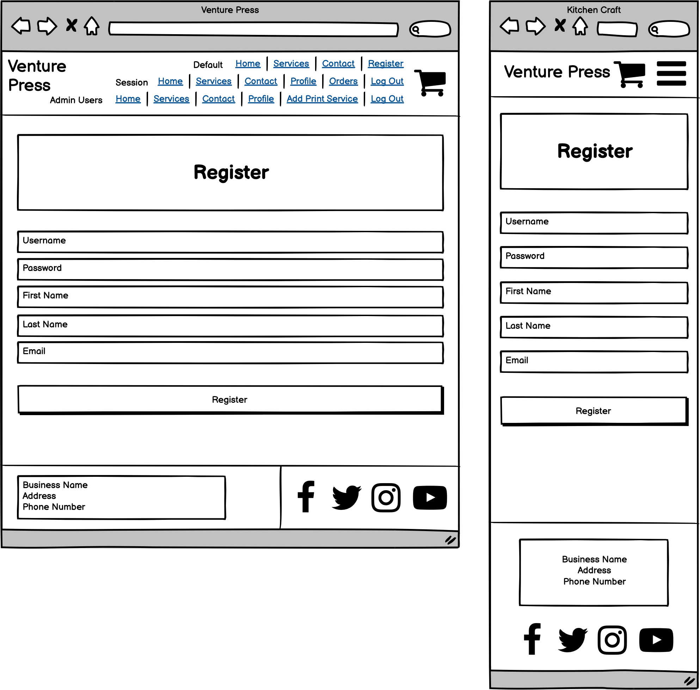
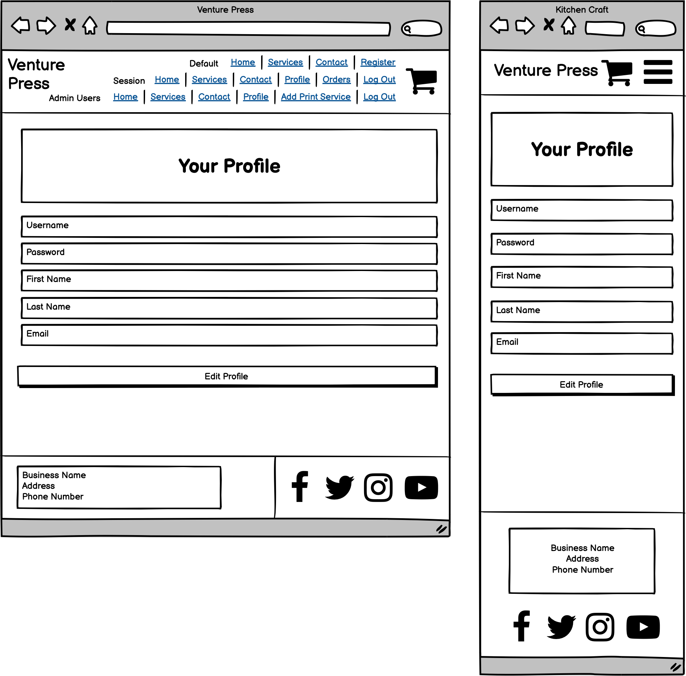

<h1 align="center">Venture-Press---Full-Stack-Frameworks-With-Django-Milestone-Project (Milestone Project #4)</h1>
<h1 align="center">Olly Lomax</h1>
<h2 align="center"></h2>

# Venture Press Website

I built this website using my knowledge of HTML5, CSS3, JavaScript, jQuery, Bootstrap, Python, PostgresSQL and Django which I have learned from Code Institute during my Diploma in Full Stack Software Development. Venture Press is an imaginary brand that I have created to showcase my knowledge and skills in the aforementioned languages and frameworks with the intention of completing my Full Stack Frameworks with Django Milestone Project.

The website’s purpose is to deliver an E-Commerce platform for a domestic printing company, offering a wide range of print services which are all purchasable through a cart and checkout flow.

View the live project [here](https://venture-press.herokuapp.com/)

## UX STRATEGY

### Goals
- To expand upon my knowledge of HTML5, CSS3, JavaScript, jQuery and Python.
- To showcase my new knowledge of Django and PostgresSQL.
- To provide a responsive website fulfilling the UX Design philosophy.
- To provide a website showcasing customisable print services for sale.
- To provide a website with means to contact the company with queries and/or custom quotations.
- To provide a website with full cart and checkout functionality for purchasing print services.
- To provide a website with user registration, profile page and order history.
- To provide a website with notification feedback through email for registration, purchases and contact form.
- To provide a website with admin functionality for adding new print services.
- To provide a website with superuser functionality for managing backend operations.

### User Stories

- As a user, I want to easily understand the purpose of the site.

- As a user, I want to clearly view the website and content on any device.

- As a user, I want to easily navigate the website so that I can find content quickly.

- As a user, I want to be able to see what print services are available and how much they are.

- As a user, I want to be able to search the website for services I may be interested in.

- As a user, I want to be able to filter the print services by category.

- As a user, I want to be able to customise my chosen service and then add it to my cart.

- As a user, I want to be able to view all services I have added to my cart before deciding whether to proceed to payment.

- As a user, I want to be able to proceed to purchasing the contents of my cart, input my card details and make the purchase.

- As a user, I want to be able to contact the company about any queries or custom quotations I might need.

- As a user, I want to be able to easily return to the website if I encounter a page error.

- As a user, I want to be able to register on the website.

- As a registered user, I want to be able to log in to my account on the website.

- As a registered user, I want to be able to log out of my account on the website.

- As a registered user, I want to be able to view my profile, edit my details and change my password.

- As a registered user, I want to be able to see a list of my order history.

- As an admin user, I want to be able to create, edit and delete print services. 

- As the superuser, I want to be able to create, edit and delete categories and services.

- As the superuser, I want to be able to create, edit and delete user details and emails.

- As the superuser, I want to be able to create, edit and delete orders.

## UX SCOPE

- ### Planned Features

    -   Creating and storing User, Category, Service, Cart and Order information inside a PostgresSQL database.
    -   Adopting UX Design Philosophy.
    -   Navigation links on all pages.
    -   Cart info on all pages.								
    -   Website title and description clearly stating intended purpose.			
    -   CRUD Functionality.							
    -   Login/Logout Functionality.	
    -   Home page with introduction, hero image and a set of example services on offer.
    -   Profile page viewable and editable by registered users.
    -   Order history page viewable by registered users.
    -   Change password page, separate from edit profile page, for users to securely change their password with validation.
    -   Print services page viewable, searchable and filterable by all users.
    -   Add/Edit Service pages for registered users to add or edit print services.
    -   Service detail pages with images, descriptions and prices viewable and purchasable by all users.
    -   Cart page with total amount of order and a list of services and their respective images, quantities and details that a user has added.
    -   Mini cart pop-up when users scroll over their cart at top right of nav menu displaying a reduced version of the same page above.
    -   Checkout page with delivery information form and stripe card input for users to process their orders.
    -   Order confirmation page showing full details of the processed order and all line items.
    -   Toast notifications for many site actions including adding items to cart, processing orders and submitting contact form.
    -   Email notifications when registering, confirming email, submitting contact form requests and processing orders.
    -   Map access to full backend functionality packaged with Django.
    -   404 and 500 error pages caught Django error handling to direct user back to website.

## UX STRUCTURE

###  User Story:
> As a user, I want to easily understand the purpose of the site.

- #### Acceptance Criteria:
    - Kitchen Craft logo displayed top left of navbar.
    - Heading at top of home page with an introduction explaining the website.
    - Cuisine of the Week recipes displayed immediately showing community content to user.

 - #### Implementation:
    The logo will be displayed at the top left of the navbar, this will be consistent throughout all pages. An h1 heading will welcome users and a paragraph below, clearly displayed in white text over a coloured background, will outline the exact purpose of the site. A background image behind the h1 header and paragraph will show kitchen related produce/utensils.

### User Story:
> As a user, I want to easily understand the purpose of the site.
- #### Acceptance Criteria:
	◦	Venture Press logo displayed top left of navbar.
	◦	Heading at top of home page over the hero image with introduction explaining the website.
	◦	Sample of Print Services available at bottom of page.
	◦	Footer including company info and social media links.
 - #### Implementation:
    The logo will be displayed at the top left of the navbar, this will be consistent throughout all pages. An h1 heading will welcome users and a paragraph below, clearly displayed in white text over the hero image, will outline the exact purpose of the site. The hero image will show print related vectors of machinery and colour spectrum.Some sample Print Services will be rendered at the bottom of the Home page which will be a filtered version of the services collection. These will be filtered at random.

### User Story:
> As a user, I want to clearly view the website and content on any device.
- #### Acceptance Criteria:
	◦	The layout of the website is well structured, clearly readable and aesthetically pleasing.
	◦	Across all viewports and devices.
 - #### Implementation:
    Utilising rows and columns within Bootstrap frameworks and mobile first design will be used when coding the project and testing will be required to ensure the layout is clear on all devices. No elements should overlap their containers and all items should be responsive so that no elements are too large to display properly. Media will scale to fit all screen sizes with no stretch or distortion.

### User Story:
> As a user, I want to easily navigate the website so that I can find content quickly.
- #### Acceptance Criteria:
	◦	Logo will link to home page on all pages.
	◦	Navigation menu will be displayed on all pages.
	◦	All navigation links will direct to the correct pages.
 - #### Implementation:
    For an unregistered user, the navigation menu will consist of:

	- Home - home.html
	    - Services dropdown menu consisting of:-
	    - Stationery - filtered services.html
	    - Advertising - filtered services.html
	    - Miscellaneous - filtered services.html
-   - All Services - services.html
	- Contact - contact.html
	- Register - register.html
	- Login - login.html
	- Cart - cart.html
	- Mini-Cart interactive popup on Cart hover - mini_cart.html

	•	For a registered user, the navigation menu will consist of:
	◦-  ome - home.html
	-   Services dropdown menu consisting of:-
	    -   Stationery - filtered services.html
	    -   Advertising - filtered services.html
	    -   Miscellaneous - filtered services.html
	    -   All Services - services.html
	-   Contact - contact.html
	-   Account dropdown menu consisting of:-
	    -   Profile - profile.html
        -   Order History - order_history.html
	    -   Message Centre - messages.html
        -   Artwork Upload - artwork.html
        -   Change Password - password_chan-    .html
	    -   Log Out - directs to home.html
	-   Cart - cart.html
	-   Mini-Cart interactive popup on Cart hover - mini_cart.html

	•	For an admin user, the navigation menu will consist of:
	-   Home - home.html
	    -   Services dropdown menu consisting of:-
	    -   Stationery - filtered services.html
	    -   Advertising - filtered services.html
	    -   Miscellaneous - filtered services.html
	    -   All Services - services.html
	-   Contact - contact.html
	-   Account dropdown menu consisting of:-
	    -   Profile - profile.html
        -   Order History - order_history.html
	    -   Message Centre - messages.html
        -   Artwork Upload - artwork.html
        -   Change Password - password_chan-    .html
        - Add Print Service - add_service.html
	    -   Log Out - directs to home.html
	    - Cart - cart.html
	    - Mini-Cart interactive popup on Cart hover - mini_cart.html

	•	For the Superuser account, there is full backend functionality via the /admin/ route.
	•	The navigation menu will be visible on all pages. Each navigation item will direct the user to the applicable page. For smaller devices the menu will collapse into a burger menu. When clicked, this menu will expand downwards displaying the same navigation items. Clicking away from this menu will close it.
### User Story:
> As a user, I want to be able to see what print services are available and how much they are.
- #### Acceptance Criteria:
	◦	Services page will be created.
	◦	Services images displayed and scaled to fit all screen sizes with no distortion.
	◦	Service descriptions clearly outlining service benefits
	◦	Service prices stand out
 - #### Implementation:
    Product images will be selected of sufficient dots per inch to clearly show the print service without loss of quality. Descriptions to be thorough enough to encourage sales and prices displayed in both a larger font size and weight.

### User Story:
> As a user, I want to be able to search the website for services I may be interested in.
- #### Acceptance Criteria:
	◦	A search bar will be displayed in the navigation bar at the top of the screen.
	◦	Placeholder text and a search button will indicate a user is able to filter services by their query.
 - #### Implementation:
    An indexing view will be created allowing users to search by the categories and services databases. When a user types in search criteria and presses the search button (or presses enter) it will return a filtered list of services based upon that criteria.

### User Story:
> As a user, I want to be able to filter the print services by category.
- #### Acceptance Criteria:
	- - Print Service categories will be listed in the dropdown of the Services navigation link as below:-
	-   Services dropdown menu consisting of:-
	    -   Stationery - filtered services.html
	    -   Advertising - filtered services.html
	    -   Miscellaneous - filtered services.html
	    -   All Services - services.html
	-   Clicking on the applicable category will filter the services by that category.
 - #### Implementation:- 
    An indexing view will be expanded upon allowing users to filter the Services database by their categories. When a user clicks the applicable category in the Services dropdown menu, it will return a filtered list of services based upon the category clicked.

### User Story:
> As a user, I want to be able to customise my chosen service and then add it to my cart.
- #### Acceptance Criteria:
	- Service detail pages will be created.
	- These will be accessible through clicking on the applicable Service on the Services page.
	- Each page will show the respective service details and various options:-
	    - Quantity input field.
	    - Select box for Paper Type.
	    - Select box for Paper Size.
	    - Select box for Print Process.
	    - Add to Cart button at the bottom.
	    - Clicking on the Add to Cart button will add this instance of the product with applicable choices to the session cart.
 - #### Implementation:- 
    Each service will be mapped to their applicable service details page through a primary key. On each page the user will be able to customise their service and add an instance of their choices to the cart which can subsequently be purchased.
	•	

### User Story:
> As a user, I want to be able to view all services I have added to my cart before deciding whether to proceed to payment.
- #### Acceptance Criteria:
	- Cart page will be created.
	- This page will be accessible by clicking on the Cart nav link, on the View Cart link on mini cart popup, or automatically when adding a service to the cart.
	- Page will display all services added and their respective customisations and quantities.
	- Quantities will be adjustable in the cart.
	- It will be possible to completely remove the service from the cart.
	- Proceed to Checkout button at bottom will direct user to payment.
	- Back to Services button will direct user back to Services page.
 - #### Implementation:- 
    This page will output the session cart to the template, listing all services added and including all the details necessary before the user makes the choice of whether to checkout or not. Removal of services and quantity adjustments will be made possible on this page itself via javascript. Once a user is happy to proceed, there will be a Checkout button or if not, a Back to Services button.

### User Story:
> As a user, I want to be able to proceed to purchasing the contents of my cart, input my card details and make the purchase.
- #### Acceptance Criteria:
	- Checkout page will be created.
	- This page will be accessible by clicking on the Proceed to Checkout nav link on the Cart page.
	- Page will display all services added and their respective customisations and quantities.
	- Page will contain a form for which the user will be required to input delivery information.
	- Page will contain a second form for Stripe payments for which the user will be required to input payment details.
	- Process Payment button will be created to initiate the order submission.
	- Back to Cart button will be created to return to the Cart page.
	- Upon successful payment, the user will be directed to an Order Summary page containing the reference details of the order.
 - #### Implementation:- 
    The Cart page will be linked to the Checkout page via a Proceed to Checkout button, at which point the details/quantities of the services are no longer editable. The same service details are displayed on this page as the Cart page, so the user will know the exact breakdown of the order before initiating payment. Two forms, one for delivery information and the other for Stripe payments will require input from the user. There will also be a Save Delivery Details button which will save the user time inputting delivery information again for the next order. Once the Process Payment button is clicked, the Stripe integration will process the payment intent with webhooks for redundancy, and if successful, direct to an order summary page referencing the details of the order. If there are errors with the payment, they will be displayed via the toast messages. An email confirmation containing this same information will be sent to the user’s email address.

### User Story:
> As a user, I want to be able to contact the company about any queries or custom quotations I might need.
- #### Acceptance Criteria:
	- Contact page will be created.
	- This page will be accessible by clicking on the Contact nav link on the main navigation bar.
	- Page will display a contact form requiring input from the user.
	- Submit Query button will be positioned below the form for users to click on when ready.
	- When the form is submitted a toast success message will show.
	- When the form is submitted an email will be sent indicated predicted response time.
 - #### Implementation:- 
    The Contact page will be accessed by navigation link inside the fixed navigation bar at the top of every page. The page itself will consist of a contact form requiring input from the user before submission of the query by clicking on a Submit Query button. Both a toast success message and a confirmation email will be initiated when the form is submitted by the user. The email will be sent to the email address in the required email input field.

### User Story:
> As a user, I want to be able to easily return to the website if I encounter a page error
- #### Acceptance Criteria:
	- 404 page will be created.
	- 500 page will be created.
	- Both pages will provide error information and a way back to the website.
 - #### Implementation:- 
    Error handling will be used to catch both 404 and 500 page errors and direct the user to the respective page. This will inform them in detail of the error in question and a link will be provided directing back to the home page.

### User Story:
> As a user, I want to be able to register on the website.
- #### Acceptance Criteria:
	- A Signup page will be created.
	- An email address, username and password will be required input fields from the user.
	- An email confirmation email will be sent to the user when the form is submitted.
	- When a user clicks on the link in the sent email, they will be directed to a confirm-email page to verify their email.
	- An information toast will show indicating an email has been sent to the email address.
	- When a user visits the link in the sent email, they will be directed to a page with a Confirm email address button.
	- When a user clicks on the Confirm button, they will directed back to the login page and a toast success message will show.
 - #### Implementation:- 
    Using Django allauth, the Signup form will capture the username, password and email which when submitted will add a user account to the Users database assuming one does not already exist using an identical email and/or username. Each input field will have its own validation including but not limited to; minimum and maximum character limits, character requirements and regular expressions. There will also be confirm email and confirm password fields as extra validation for the user's protection. When a successful form is submitted, a toast message will show and an email will be sent requiring email verification. When the link in the email is clicked, user is directed to the a unique confirm-email page where they can confirm their account by clicking on the Confirm button. Upon a successful verification a toast success message will appear and the the user will be directed back to the login page.

### User Story:
> As a registered user, I want to be able to log in to my account on the website.
- #### Acceptance Criteria:
	- A Login page will be created.
	- An email address OR username, and password inputs will be required by the user.
	- Password will be checked against the email OR username input for an account in the Users database.
	- If the details input match those of a valid user account, then a user session is initiated.
 - #### Implementation:- 
    Using Django allauth, the Login form will capture the username, password and email which when submitted will search for a user account in the Users database matching both inputs. Each input field will have its own validation including but not limited to; minimum and maximum character limits, character requirements and regular expressions. When a successful form is submitted, a user session will be initiated and a toast message will show a successful login and the user will be directed to the home page.

### User Story:
> As a registered user, I want to be able to log out of my account on the website.
- #### Acceptance Criteria:
	- A Logout page will be created.
	- User will be asked if they are sure about logging out.
	- Cancel button will be created for cancelling log out.
	- Sign Out button will be created to log out of account.
	- A toast success message will be displayed on successful log out.
 - #### Implementation:- 
    Using Django allauth, the Logout form will check whether the user wants to log out of their account or not. If they click on the Cancel button then they will be directed back to the home page. If they click on the Sign Out button then the user session will be deleted, a toast success message will appear and they will be subsequently directed back to the home page.

### User Story:
> As a registered user, I want to be able to view my profile, edit my details and change my password.
- #### Acceptance Criteria:
	- Profile page will be created.
	- Edit profile page will be created.
	- Change password page will be created.
	- Buttons on the profile page will be displayed to edit profile and/or change password which will link to their respective pages.
	- An Order History and Sign Out button will be underneath the form.
 - #### Implementation:- 
    A Profile page containing a form with new fields including First and Last name as well as delivery details will be shown. These fields will be empty by default as they were not required upon registration. The Edit Profile button will link to the respective page where the user can edit First Name, Last Name and Delivery information. Username changes are not permitted. The Change Password button will direct to the respective page where the user can edit their password. This will have the same validation and confirmation field as the registration page. Upon successful edits of profile or password, a toast message will let the user know if it was successful. A cancel button will also be included on each form to return to the profile page. An Order History button will be displayed which will direct the user to the Order History page. Finally, a Sign Out button will be displayed on the profile page which will terminate the session and return the user to the login page with a successful log out toast message.

### User Story:
> As a registered user, I want to be able to see a list of my order history.
- #### Acceptance Criteria:
	- Order History page will be created.
	- A table showing the user’s list of orders will be displayed.
	- Order Number, Date, Line Items and Total will be shown in the table.
	- Order Number will be an anchor linking to an Order Details page specific to that order.
	- A Back to Profile button will be underneath the table.
 - #### Implementation:- 
    The order history page will contain an iterated list of all past order submissions from the user in tabular format. The table will show the Order Number, Date, Line Items and the Total for every past order. The Order number itself in each table row will be an anchor linking to the pertaining Order Details page which will outline the order in more detail including Delivery and Billing information and charges. A Back to Profile button will be created beneath this table which when clicked, will direct the user back to their Profile page.

### User Story:
> As an admin user, I want to be able to create, edit and delete print services. 
- #### Acceptance Criteria:
	- Add Service page will be created.
	- Edit Service page will be created.
	- Edit and Delete buttons will be shown on every Service on the Services page, and on every Service Details page.
	- Clicking on any Delete button will initiate a dialog popup asking the admin user to confirm deletion.
	- Confirm Deletion and Cancel buttons will be displayed on the dialog popup.
	- Cliking on the Cancel button will return the admin user to the Services page.
	- Clicking on the Confirm Delete button will remove the Service from the Services database.
 - #### Implementation:
    If a user is authenticated as an admin then inside the Profile dropdown menu within the navigation bar, an Add New Service navigation link will be displayed. Clicking on this link will direct the admin user to the Add Service page. This page will contain a form with the applicable fields from the Services model including Category, SKU, Description, Paper Size, Paper Type, Print Process and Service Image. An Add Product button will be displayed beneath this form which when clicked, will attempt to add the Service to the Services database. If form submission is successful, then the Service will be added, a toast success message will be displayed and the admin user will be directed to the pertaining Service Detail page.

    If a user is authenticated as an admin, then an Edit button will be displayed inside every Service card on the Services page. Clicking on the Edit button will direct the admin user to the applicable Edit Service page. On this page a form will be displayed with all fields set to the current values of the specific service. The admin user is able to change the values of these fields and click on the Confirm Edit button beneath the form to submit the changes to the Services database. A cancel button will also be displayed which when clicked, will direct the admin user back to the Services page. An Edit button with the same functionality will also be displayed on each specific Service Details page. The Edit button will function in the exact same way, with the only difference being the Cancel button on the dialog popup will direct back to the specific Service Detail page instead of the Services page.
- If a user is authenticated as an admin, then a Delete button will be displayed inside every Service card on the Services page, next to the Edit button. Clicking on the Delete button will initiate a dialog popup asking the admin user to confirm the deletion with Confirm Deletion and Cancel buttons below. Clicking on the Confirm Deletion button will delete the pertaining Service from the Services Database. Clicking on the Cancel button will direct the admin user back to the Services page. A Delete button with the same functionality will also be displayed on each specific Service Details page. This button will function in the exact same way, the only difference being the Cancel button on the dialog popup will divert back to the pertaining Service Detail page instead of the Services page.

### User Story:
> As the superuser, I want to be able to create, edit and delete categories and services.
- #### Acceptance Criteria:
	- Add Category button and page using Django’s built-in administration.
	- Add Service button and page using Django’s built-in administration.
	- Delete Category button using Django’s built-in administration.
	- Delete Service button using Django’s built-in administration.
	- Delete Category checkbox and Delete selected categories option for batch deletion.
	- Delete Service checkbox and Delete selected services option for batch deletion.
 - #### Implementation:- 
    Utilising built-in Django administration’s user interface, a superuser can create, update and delete Categories and Services within the database with the applicable fields designated in the model.

### User Story:
> As the superuser, I want to be able to create, edit and delete user details and emails.
- #### Acceptance Criteria:
	- Add User button and page using Django’s built-in administration.
	- Add Email Address button and page using Django’s built-in administration. 
	- Delete User button using Django’s built-in administration.
	- Delete Email Address button using Django’s built-in administration.
	- Delete User checkbox and Delete selected users option for batch deletion.
	- Delete Email Address checkbox and Delete selected email addresses option for batch deletion.
 - #### Implementation:
    Utilising built-in Django administration’s user interface, a superuser can create, update and delete Users and Email Addresses within the database with the applicable fields designated in the model- 
### User Story:
> As the superuser, I want to be able to create, edit and delete orders.
- #### Acceptance Criteria:
	- Add Order button and page using Django’s built-in administration.
	- Delete Order button using Django’s built-in administration.
	- Delete Orders checkbox and Delete selected orders option for batch deletion.
 - #### Implementation:
    Utilising built-in Django administration’s user interface, a superuser can create, update and delete Orders within the database with the applicable fields designated in the model.

## UX SKELETON

- ### Database Design

- ### Security

    Database connection details are set up securely in the IDE for development, and securely in Heroku for production. 
    They are not uploaded to GitHub for security reasons.

- ### Wireframes

    - Home (mobile & desktop)
    
    - Services (mobile & desktop)
    
    - Service Detail (mobile & desktop) 
    
    - Edit Service (mobile & desktop) 
    
    - Add Service (mobile & desktop) 
    
    - Contact (mobile & desktop) 
    
    - Register (mobile & desktop) 
    
    - Cart (mobile & desktop) 
    
    - Checkout (mobile & desktop) 
    
    - Order Confirmation (mobile & desktop) 
    
    - Login (mobile & desktop) 
    
    - Profile (mobile & desktop) 
    
    - Edit Profile (mobile & desktop) 
    
    - Order History (mobile & desktop) 
    
    - 404 (mobile & desktop) 
    

As referenced in the notable amendments to design, I created two additional models.

## UX SURFACE

- ### Colour Scheme

    
    
    

    I used three main colours for the website. Two shades of blue for most block component elements and an off white for contrast. I felt like they complimented each other well, provided an aesthetically pleasing and user friendly theme and provided the necessary contrast to use exclusively throughout the design process.

- ### Typography
    I used the Roboto font family with weight variations for all content throughout the website which is well recognised and a standard in web design.

- ### Imagery
    I sourced the Venture Press main logo from Flaticon, a free resource for vectors and icons.The home page hero image was sourced from free Adobe Stock images. The service images were sourced from a combination of Unsplash, a free stock image website and Shutterstock free trial which are free for personal and commercial use. Using my knowledge of Adobe Photoshop and Illustrator, all images have been selected and edited/exported with as much uniformity as possible and downsampled to decrease page load times.

- ### Notable amendments to Design

    Instead of repeating content by inserting some random services onto the home page as planned, after building the Services, Categories, Orders and Accounts models I decided to make another two models for Contact and Artwork.

   ### Contact App
    This app is designed to receive contact requests from both unregistered and registered users. If a user is registered, then fields will be pre-filled and when message is submitted it will be saved to a Message Centre page where all previous messages can be seen. The functionality is also present to view previous messages, update them and delete them altogether.

    When a contact request is submitted, it also sends a confirmation of the contact to the user's email with corresponding message content as well as the admin email to alert site owners.
    - Contact Model
    - ContactForm
    - Additional templates:
        - contact.html
        - success.html
        - edit_message.html
        - messages.html
        - past_message.html
        - contact_confirmation_email_body.txt
        - contact_from_email_body.txt
        - contact_email_subject.txt
    - Additional views:
        - contact
        - success
        - edit message
        - delete message

    ### Artwork App
    This app is designed for registered users who have purchased a print service. The print order will subsequently appear in a new page called Artwork Uploads with corresponding file upload buttons. When a file is uploaded for the pertaining order, the file is submitted to the AWS database with relevant file info, and the order will disappear from the user's Message Centre.
    - Artwork Model
    - ArtworkUpload Form
    - Additional templates:
        - artwork.html
        - custom_clearable_file_input.html
    - Additional views:
        - orders_requiring_artwork
        - upload_artwork

    ### General changes

    I had planned to add another user permission of admin, but since there is a built-in django option in the django administration backend for this I decided against and focused my time elsewhere, including but not limited to making custom allauth classes and customising the inherited forms.

## Features

- ### Current

    - Responsive across all viewports using Bootstrap classes.
    - Mobile responsive design.
    - Home page displaying hero image and clear information on the purple of the website.
    - Registration functionality.
    - Log In / Log Out functionality.
    - Navigation menu that will change based on whether user is logged in and/or has certain privileges.
    - Services page with a list of all services in the PostgresSQL database with corresponding name, description and price. Edit and Delete buttons available on each service for admin users.
    - Service Details page with customisable options, quantity input and Add to Cart functionality.
    - Contact page with form submission and email response.
    - Add New Service page with Create functionality for admin users.
    - Edit Service page with Update functionality for admin users.
    - Profile page for registered users with profile info.
    - Edit Profile page with Update functionality.
    - Change Password page with Update functionality.
    - Order History page showing all previously submitted orders by the user.
    - Mini Cart display when hovering over Cart button.
    - Cart page showing all services added by the user to their shopping cart.
    - Checkout page showing cart details and forms to submit delivery information and card payment.
    - Stripe webhooks in place for redundancy.
    - Order Confirmation page showing order details once successfully processed.
    - Django administration backend.
    - Error handling to direct user to 404 and 500 error pages and provide a direct path back to the website.

- ### Prospective

    - Add pagination for Services page for future scoping the website when services are expanded upon.

## Technologies Used

-   ### Languages
    - [HTML5](https://en.wikipedia.org/wiki/HTML5) 
        The language used to display content and provide structure used extensively throughout this site.
    - [CSS3](https://en.wikipedia.org/wiki/Cascading_Style_Sheets) 
        I used custom styling on top of Bootstrap frameworks.
    - [JavaScript](https://en.wikipedia.org/wiki/JavaScript) 
        I used custom JavaScript on top of Bootstrap frameworks.
    - [Python](https://www.python.org) 
        The core of this project was built using Python 3.8.11 logic and the means to run/view the website.
        Python Modules used from the requirements.txt file:

        -   asgiref==3.5.2-    
        -   boto3==1.24.22
        -   botocore==1.27.22
        -   dj-database-url==0.5.0
        -   Django==3.2.13
        -   django-allauth==0.41.0
        -   django-countries==7.2.1
        -   django-crispy-forms==1.14.0
        -   django-storages==1.12.3
        -   gunicorn==20.1.0
        -   jmespath==1.0.1
        -   oauthlib==3.2.0
        -   Pillow==9.1.1
        -   psycopg2-binary==2.9.3
        -   python3-openid==3.2.0
        -   pytz==2022.1
        -   requests-oauthlib==1.3.1
        -   s3transfer==0.6.0
        -   sqlparse==0.4.2
        -   stripe==3.4.0

    - [Django](https://www.djangoproject.com) 
        A high-level Python web framework following Model-View-Template design.

-   ### Frameworks, Libraries & Programs
    - [Bootstrap v5.1](https://materializecss.com/) 
        Framework used throughout the site to provide baseline styling and import JavaScript/jQuery.
    - [PostgreSQL](https://www.postgresql.org/) 
        PostgreSQL was used to create the relational databases used as data storage for this project.
    - [Heroku](https://www.mongodb.com/) 
        Used to deploy the live version of the website.
    - [Google Fonts](https://fonts.google.com/) 
        Used to import the Roboto font used throughout the website.
    - [Font Awesome](https://fontawesome.com/) 
        Used for various icons including social media and navigation icons.
    - [jQuery](https://jquery.com/) 
        jQuery is used for the following: 
        -   Mini cart popup 
        -   Getting the current year being injected into the copyright footer. 
        -   Increment/Decrement quantity inputs. 
        -   Bootstrap tooltips. 
        -   Bootstrap toasts 
        -   Bootstrap modal dialogs. 
    - [Git](https://git-scm.com/) 
        Used for version control to commit and push code via Gitpod to the GitHub repository where the source code is stored.
    - [Gitpod](https://www.gitpod.io/) 
        This is the IDE (Integrated Development Environment) I used to build the website and commit to Git and push to GitHub
    - [GitHub](https://github.com/) 
        GitHub is used to store the projects code after being pushed from Git and to host the deployment of the live site via GitHub Pages.
    - [Adobe Photohop](https://www.adobe.com/uk/products/photoshop.html) 
        Used to convert and resize images before uploading to local repository.
    - [Adobe Illustrator](https://www.adobe.com/uk/products/illustrator.html) 
        Used to edit logo and export documents before uploading to local repository.
    - [Balsamiq](https://balsamiq.com/) 
        Used during the scoping process to visualise the basic structure of the website and create wireframes during the Skeleton phase of UX Design.

-   ### Resources, Tools & Diagnostics
    - [Unsplash](https://unsplash.com/) 
        Free stock image database used for some service images.
    - [Shutterstock](https://www.shutterstock.com) 
        Paid stock photo database which I used for all product images. These images are licensed under the free trial of 10 image downloads.
    - [Adobe Stock](https://stock.adobe.com) 
        10 Free stock images used for some service images and hero image.
    - [Flaticon](https://www.flaticon.com/) 
        Free stock resource for vectors and icons, used for Venture Press logo.
    - [TinyJPG](https://tinyjpg.com) 
        Used to downsample images to smaller file sizes in order to increase load times and reduce storage requirements.
    - [Favicon.io](https://favicon.io/) 
        Used in the creation of the website Favicon across all pages.
    - [Chrome DevTools](https://developer.chrome.com/docs/devtools/) 
        Used throughout the design process for debugging purposes in console.
    - [Safari Web Inspector](https://developer.apple.com/safari/tools/) 
        Used as above for cross-browser support.
    - [Firefox Developer Tools](https://developer.mozilla.org/en-US/docs/Tools) 
        Used as above for cross-browser support.
    - [Am I Responsive?](http://ami.responsivedesign.is/) 
        Used to create a website mock-up image across different sized devices to showcase viewport responsiveness.
    - [WAVE](https://wave.webaim.org/) 
        Used for diagnostic contrast testing.
    - [Lighthouse](https://developers.google.com/web/tools/lighthouse) 
        Used for diagnostic performance, accessibility and SEO testing.
    - [W3C Markup Validation Service](https://validator.w3.org/) 
        HTML Validator used to validate every page of the project to ensure there were no syntax errors.
    - [W3C CSS Validation Service](https://jigsaw.w3.org/css-validator/) 
        CSS Validator used to ensure there were no syntax errors in styling.
    - [JSHint](https://jshint.com/) 
        JavaScript related tool to check for errors and potential problems in my JavaScript code
    - [PEP8Online](http://pep8online.com/) 
        Python related tool to check for PEP8 compliance.

## Testing

- The W3C Markup Validator Service was used to validate every page in the project to ensure there were no syntax errors or warnings.
    - All pages with one exception cleared with no errors or warnings as below.
        
    - The Artwork page I created, despite being functional, is returning duplicate id errors. I have been debugging this but ran out of time, so I included the additional app regardless with notation.
        
    - Pages requiring a a login session or admin/superuser status returned no errors or warnings. They were tested by the following approach:
        - Copy full HTML in developer tools from the desired page.
        - Go to the [W3C Markup Validator Page](https://validator.w3.org/nu/).
        - Click on the 'Check by' dropdown option.
        - Select 'text input'.
        - Paste HTML into the text area provided.

- The W3C CSS Validator was used to validate my project css files to ensure there were no errors or warnings.    
    - This returned 22 warnings which all came from frameworks or external libraries.
        - 16 from Bootstrap Parse errors
        - 6 from FontAwesome animation delays.
    
- To make sure that all my css files are error free, I used the following approach:
    - Copy my css code from each css file file.
    - Go to [W3C CSS Validation Page](https://jigsaw.w3.org/css-validator/).
    - Click on the 'By direct input' tab at the top of the window.
    - Paste my css code into the supplied text area.
    - Click on 'Check'
    

- WAVE, a Web Accessibility Evaluation Tool was used for contrast, labelling semantic design testing.
    - No contrast errors found.
    - All labels present.
    - Semantically structured with only 2 warnings returned for intentional repeated anchor links.

    

- Lighthouse was used for performance, accessibility and SEO testing. 
    - Each page returned a score of **90-100** for each page.
    
    - The reason for the score of 67 for Best Practices on mobile is due to vulnerabilities detected with the latest version of jQuery
    

- JSHint, a JavaScript Static Code Analysis Tool was used to check all .js files for the coherence and quality of my code, making sure it is error free and that no potential problems exist. All files returned clear of any errors or warnings.
    

- PEP8 online is a tool to check the conformity of my code to the PEP8 python coding convention.
    - All Python files returned full PEP8 comformity as below.
    

- I ran the website locally and tested on the deployed version. No differences found.

## Unit Testing
- Unit testing was done using python unittest.

    The testing included:

    - Routing to all pages available prior to registration.
    

    **Note**
    Further tests will include:
    - Routing to all session secured views
    - CRUD functionalty
    - Form submission

## Test Strategy
 - The testing will be done on four web browsers:-
    - Chrome
    - Firefox
    - Safari
    - Edge

    And on every common breakpoint (Mobile, Tablet, Desktop, XL Desktop).

 - Validation of feature inclusion will be undertaken from the wireframes scoped during the Skeleton stage of UX design.
 
 - Elements should not overlap other container divs and should remain on the screen at all sizes above and including 300px.

 - Testing is required on all features and user stories documented in this README. All clickable links must direct to the correct pages. All forms linked to PostgresSQL must be tested to ensure they insert all respective fields into the applicable collections.

## User Story Testing

> As a user, I want to easily understand the purpose of the site.

 - The title of the site is shown in the browser with a favicon.

 - A hero image and introduction is shown beneath the navigation menu on the home page.

 - A small section containing print services available is displayed beneath the hero image.

> As a user, I want to clearly view the website and content on any device.

  - The site is fully viewable and functional on Mobile, Tablet, and Desktop viewports.

> As a user, I want to easily navigate the website so that I can find content quickly.

 - On desktop, there is a navigation menu at the top of the page which indicates other pages the user can visit.

 - On tablet and mobile, there is a burger menu which allows the user to get around the site.

 - Clicking the venture press name logo takes the user to the homepage.

> As a user, I want to be able to see what print services are available and how much they are.

 - From loading the home page, simply scrolling down to below the hero image will show a small cross-section of services available to purchase, with details clearly displayed.

 - Clicking on the Services button in the hero image should direct the user to an unfiltered services page with all services displayed with associated details.

 - Using the navigation menu, clicking on Services will trigger a dropdown menu with an 'All Services' option available to click. Clicking on this will return the same unfiltered Services page as the link in the hero image does.

> As a user, I want to be able to search the website for services I may be interested in.

 - At the top of every page inside the navigation menu, there will be a search bar. 

 - Searching for a service name will return only that service. 

 - Searching for a category will return all services pertaining to that category.

 - Partial searches should still return results, including searching content in service descriptions.

 - Searching with no query should bring up a toast error message. 

 - Clicking the search icon as well as hitting enter will both allow the user to search once a term has been typed in.

> As a user, I want to be able to filter the print services by category.

 - Clicking on Services in the navigation bar will trigger a dropdown menu of categories. 

 - Clicking on any of these categories will take the user to a filtered version of the Services page based on the category chosen.

 - This category and the number of services within it will be displayed at the top of the filtered results with a link to go back to an unfiltered page. 

 - The page itself will show the details of each print service, including an image, price, description, category and a link to show more details.

> As a user, I want to be able to customise my chosen service and then add it to my cart.

 - Clicking on any service will bring up a Service Details page with customisable options. These options will include various paper choices, print process and quantity required.
 
 - Clicking on any service will bring up a Service Details page with an option to change quantity. Changing the quantity will adjust the price displayed accordingly.
 
 - Clicking on any service will bring up a Service Details page and underneath the customisable options there will be an 'Add to Cart' button.

 - Adding a service to the cart will initiate a toast success message and save an instance of the service with the chosen options to the session cart.

 - The price below the Cart icon at the top right of the navigation menu will change to reflect the items added to the Cart.

> As a user, I want to be able to view all services I have added to my cart before deciding whether to proceed to payment.

 - Hovering over the Cart icon on the navigation menu should initiate a mini cart popup displaying all services currently in the cart and a cart total.

 - Beneath this information will b a 'View Cart' button.

 - Hovering away from the Cart icon and/or the cart popup itself will cause the cart popup to disappear.

 - Clicking on the Cart icon on the navigation menu or hovering over it to initiate the mini cart popup then clicking on 'View Cart' will both direct the user to the full Cart page.

 - This page will clearly display all services currently in the cart, delivery charges and a cart total.

 - Beneath this information will be a 'Checkout' button.

> As a user, I want to be able to proceed to purchasing the contents of my cart, input my card details and make the purchase.

 - Once on the Cart page, beneath the cart contents will be a 'Checkout' button. Clicking on this button will bring up the Checkout page.

 - On the Checkout page, information regarding the cart contents and totals will be displayed along with input forms for both delivery details and card capture.

 - Filling in the forms with valid inputs then clicking on the 'Submit Order' button will process the order and direct to an Order Confirmation page with details of the order.

 - Form validation on the Checkout page will initiate toast error messages if for example, card details are invalid or if a required field has no input.

> As a user, I want to be able to contact the company about any queries or custom quotations I might need.

 - Clicking on the 'Contact' link in the navigation menu at the top of the page will bring up a Contact page.

 - On this page will be a contact form with a category selector and required inputs.
 
 - Choosing a category for the query, filling in the required fields and clicking on the 'Submit Query' button will save the query to the Contact database, initiate a toast success message and send a confirmation email to the address input in the form.

> As a user, I want to be able to easily return to the website if I encounter a page error.

 - When a 404 page error is found, click on the home link to get back to the homepage.

 - When a 500 page error is found, click on the home link to get back to the homepage.

> As a user, I want to be able to register on the website.

 - Assuming there is no current session, a 'Register' link on the navigation bar is displayed. Clicking on this link will direct to the Register page. This page contains a form with required inputs.
 
 - If the passwords input match in both input boxes, and both emails match in both input boxers and the username doesn't already exist then upon submitting the form a user account will be created in the Users database. 

 - This will initiate an info message for the user to check their email in order to confirm it as well as an email sent to the address input on registration with the link necessary to confirm the email address. 

 - Clicking on this link will direct the user to a confirmation page whereby clicking on the 'Confirm' button will verify the address and subsequently allow the user to login to their account.

> As a registered user, I want to be able to log in to my account on the website.

 - When not logged in or in a new session, a 'Login' link should be visible inside the main navigation menu at the top of every page.

 - Filling in the correct login details will initiate a user session.

> As a registered user, I want to be able to log out of my account on the website.

 - When logged into a user session, the main navigation bar will have a 'User' option which when clicked, will initiate a dropdown menu with several options.

 - One of these options will be a 'Logout' link, which when clicked, will initiate a toast success message and delete the current user session and direct the user back to the homepage.

> As a registered user, I want to be able to view my profile, edit my details and change my password.

 - When logged into a user session, the main navigation bar will have a 'User' option which when clicked, will initiate a dropdown menu with several options.

 - One of these options will be a 'Profile' link, which when clicked, will direct the user to a Profile page specific to their user account. On this page profile information is stored and displayed.
 
 - When on the Profile page, beneath the profile information will be an 'Edit Profile' button.

 - Clicking on this button will direct the user to an Edit Profile page specific to their user account.

 - Changing/Adding any details then clicking on 'Update Profile' will update the profile details, initiate a toast success message and direct the user back to their Profile back which will reflect the changes in values.

 - When on the Profile page, beneath the profile information will be an 'Change Password' button.

 - Clicking on this button will direct the user to a Change Password page specific to their user account.

 - Changing the password and confirming the change then clicking on 'Update Password' will update the password details and direct the user back to their Profile with a toast success message.

> As a registered user, I want to be able to see a list of my order history.

 - When logged into a user session, the main navigation bar will have a 'User' option which when clicked, will initiate a dropdown menu with several options.

 - One of these options will be an 'Order History' link, which when clicked, will direct the user to an Order History page specific to their user account.

 - On this page all the previous order information will be displayed to the user.
 
 - After navigating to the Order History page, each individual order in the list will be clickable and direct to an Order Confirmation page specific to that order.

 - This page will have a more details breakdown of the order with delivery information and beneath that a 'Back to Orders' button which will direct back to the main Order History page.

> As an admin user, I want to be able to create, edit and delete print services.

 - When logged in as an admin user, the "Add New Service" option will be available in the dropdown menu when clicking on the User button in the main navigation bar.

 - This will take the user to an Add Service page with a form to fill in to add a new service to the Services database.

 - On the Services page, on every displayed service will be an 'Edit' button within the card.

 - Clicking on this button will direct to an Edit Service page with a form where the fields can be amended and a 'Confirm Changes' buttons can be clicked to submit the update to the database.

 - When changes are made and the button clicked, a toast success message is initiated and the user is directed back to the previous page.

 - On any Service Details page there will be an 'Edit' button within the product details.

 - Clicking on this button will direct to an Edit Service page with a form where the fields can be amended and a 'Confirm Changes' buttons can be clicked to submit the update to the database.

 - When changes are made and the button clicked, a toast success message is initiated and the user is directed back to the previous page.

 - On the Services page, on every displayed service will be a 'Delete' button within the card.

 - Clicking on this button will initiate a dialog window asking user to confirm the deletion. On the dialog window there will a 'Confirm Deletion' button and a 'Cancel' button.

 - Clicking on the 'Confirm Deletion' button will initiate a toast success message, delete the pertaining service from the Services database and direct the user to the Services page.

 - Clicking on the 'Cancel' button will direct user back to the Services page without deletion.

 - On any Service Details page there will be an 'Delete' button within the card.

 - Clicking on this button will initiate a dialog window asking user to confirm the deletion. On the dialog window there will a 'Confirm Deletion' button and a 'Cancel' button.

 - Clicking on the 'Confirm Deletion' button will initiate a toast success message, delete the pertaining service from the Services database and direct the user to the Services page.

 - Clicking on the 'Cancel' button will direct user back to the specific Service Details page.

> As the superuser, I want to be able to create, edit and delete categories and services.

 - When logged in as the superuser in the django administration section of the website, clicking on the Categories menu item on the left hand side will open a Categories page where a list of current Categories are displayed.

 - These will be editable by clicking on each Category, making desired changes to the fields then clicking on the 'Save' button. 

 - Categories can be deleted by either using the checkboxes on the left hand side of the list of categories then using the 'Delete selected categories' option in the action selector, or by clicking on each individual category and clicking on the 'Delete' button. 

 - New categories can also be added using the 'Add Category' button.

 - When logged in as the superuser in the django administration section of the website, clicking on the Services menu item on the left hand side will open a Services page where a list of current Services are displayed.

 - These will be editable by clicking on each Service, making desired changes to the fields followed by clicking on the 'Save' button.

 - Services can be deleted by either using the checkboxes on the left hand side of the list of services then using the 'Delete selected services' option in the action selector, or by clicking on each individual service and clicking on the 'Delete' button.

 - New services can also be added using the 'Add Service' button.

> As the superuser, I want to be able to create, edit and delete user details and emails.

 - When logged in as the superuser in the django administration section of the website, clicking on the Users menu item on the left hand side will open a Users page where a list of current Users are displayed.

 - These will be editable by clicking on each User, making desired changes to the fields followed by clicking on the 'Save' button. 

 - Users can be deleted by either using the checkboxes on the left hand side of the list of users then using the 'Delete selected users' option in the action selector, or by clicking on each individual user and clicking on the 'Delete' button.

 - New users can also be added using the 'Add User' button.

 - When logged in as the superuser in the django administration section of the website, clicking on the Email addresses menu item on the left hand side will open an Email addresses page where a list of current Email addresses are displayed.

 - These will be editable by clicking on each Email address, making desired changes to the fields followed by clicking on the 'Save' button. 

 - Email addresses can be deleted by either using the checkboxes on the left hand side of the list of email addresses then using the 'Delete selected email addresses' option in the action selector, or by clicking on each individual email address and clicking on the 'Delete' button.

 - New email addresses can also be added using the 'Add Email address' button.

> As the superuser, I want to be able to create, edit and delete orders.

 - When logged in as the superuser in the django administration section of the website, clicking on the Orders menu item on the left hand side will open a Orders page where a list of current Orders are displayed.

 - These will be editable by clicking on each Order, making desired changes to the fields followed by clicking on the 'Save' button. 

 - Orders can be deleted by either using the checkboxes on the left hand side of the list of orders then using the 'Delete selected orders' option in the action selector, or by clicking on each individual order and clicking on the 'Delete' button.

 - New orders can also be added using the 'Add Order' button.

The live project is deployed [here](https://venture-press.herokuapp.com/).

## Test Results

Test results can be found below.

 - Link directly to the Google Sheet [here](https://docs.google.com/spreadsheets/d/19QKG2UDOJREVHE7_k47eb-r-S2i-CKOldfp3_QO0AsA).

 - Downloadable .pdf format [here](media/readme/test-case-scenarios.pdf).

 - Downloadable .xlsx format [here](media/readme/test-case-scenarios.xlsx).

## Test Fails and Resolutions

Passed all test scenarios.

## Out of Scope: Additional Feature Backlog

- Make sure that the logo itself links to the home page as well as the text.
- Remove the category dropdown from the navigation menu, and integrate category filtering into the Services page itself.
- Add form validation to restrict empty search terms entirely, rather than allow the search with an error toast message.

## Deployment

### Project Creation
I created this project by first installing the Gitpod [plugin](https://www.gitpod.io/). I then navigated to the Code Institute [gitpod-full-template](https://github.com/Code-Institute-Org/gitpod-full-template) and clicked on the "Use this Template" button. I chose and input my project name (Venture-Press---Full-Stack-Frameworks-With-Django-Milestone-Project) then created my repository from the template by clicking the button. After that I simply clicked on the "Gitpod" button from my repository page to open up my IDE and begin coding.

The following commands were used throughout the development process:

- **git status** 
 Used to show my untracked and staged files.
- **git add** 
 Used to add files to the staging area before committing.
- **git commit -m** 
 Used to commit the changes to my local repository.
- **git push** 
 Used to push all committed changes to the GitHub repository.
- **git log** 
 Used to show a list of my previous commits.
- **git reset --hard** 
 Used with applicable checksum to revert to a previous commit.

### Deployment to Heroku

- Create application:

    - Navigate to the [Heroku website](https://id.heroku.com/) and login.
    - Click on the 'New' button
    - Browse down to 'Create New App' link and click.
    - Enter the desired name of the app, in this case I called it the same as on Github.
    - Select the region, in this case 'Europe'.

- Connect to Github Repository:

    - Click the 'Deploy' tab at the top of dashboard.
    - Select 'GitHub' then 'Connect to GitHub'.
    - A prompt to find your github repository will then be displayed.
    - Enter your repository name in the search field and press enter.
    - Once you have found the desired repo, click the 'Connect' button.

- Set the environment variables:

    - Click the 'Settings' tab at the top of the dashboard.
    - Click the 'Reveal Config Vars' button.
    - Add the following: 

      ****************

- Enable automatic deployment:

    - Click the 'Deploy'' tab at the top of the dashboard.
    - Scroll down to the automatic deploys section.
    - Choose the branch you want to deploy from.
    - Click on 'Enable Automatic Deploys'.

- Website deployed [here](https://venture-press.herokuapp.com/)

### Run Locally

This project will not run locally with database connections without the environment variables stored securely in Heroku. These details are required but due to both security and privacy they are not disclosed in this repository.

- Navigate to my [Github Repository](https://github.com/ollylomax/Venture-Press---Full-Stack-Frameworks-With-Django-Milestone-Project).
- Click the 'Code' button for a drop down menu.
- Download and unpack the ZIP file then and open with the IDE you prefer.
#### OR
- Navigate to my [GitHub Repository](https://github.com/ollylomax/Venture-Press---Full-Stack-Frameworks-With-Django-Milestone-Project).
- Click the 'Code' button for a drop down menu.- Copy Git URL from the HTTPS dialogue box.
- Open the IDE you prefer then open a terminal window in a directory of your choice.
- Use the **git clone** command in the terminal followed by the copied git URL.
- A clone of the project will be created locally on your machine.

- Once this is done run the following command in the shell to install all the required packages:
> pip install -r requirements.txt

### Fork Project 

Forks are used to either propose changes to other projects or to use as a starting point to build upon your own development ideas.

- Navigate to my [GitHub Repository](https://github.com/ollylomax/Venture-Press---Full-Stack-Frameworks-With-Django-Milestone-Project).
- Click on the 'Fork' button at the very top right of the page.
- This will create an identical duplicate of the project in your own repository.

## Credits
 - ### Code

    Bootstrap 5.1 was used throughout the project to assist in making site responsive using the Bootstrap Grid System.

    jQuery library was used in my script files to make document traversal and manipulation easier as well as to make code less verbose.

    I used the [Code Institute Increment/Decrement JavaScript]() from the boutique-ado walkthrough lessons for my on my service and cart pages.

- ### References
    https://stackoverflow.com/questions/36515187/django-get-object-or-404-or-filter-exists

    https://stackoverflow.com/questions/38388423/what-does-on-delete-do-on-django-models
    
    https://stackoverflow.com/questions/43267339/is-there-a-way-to-undo-a-migration-on-django-and-uncheck-it-from-the-list-of-sho

    https://stackoverflow.com/questions/4271686/model-object-has-no-attribute-save

    https://stackoverflow.com/questions/18786939/could-not-be-changed-because-the-data-didnt-validate-django

    https://stackoverflow.com/questions/64686380/why-is-my-django-form-not-valid-cant-get-the-post-request-to-update-database

    https://stackoverflow.com/questions/8389880/django-select-option-in-template

    https://stackoverflow.com/questions/63586714/how-can-you-dynamically-set-initial-value-of-form-select-field-at-the-time-of-re

    https://stackoverflow.com/questions/27732772/how-to-access-initial-values-of-form-fields-in-a-loop-in-django-templates

    https://stackoverflow.com/questions/43959790/how-do-i-include-the-id-field-in-a-django-form

    https://stackoverflow.com/questions/28994963/how-to-assign-a-value-to-a-django-form-field-in-the-template

    https://docs.djangoproject.com/en/4.0/ref/models/fields/

    https://stackoverflow.com/questions/26312219/operationalerror-no-such-column-django

    https://stackoverflow.com/questions/68564615/how-can-i-display-my-product-variations-separately-in-the-shopping-cart-template

    https://inloop.github.io/sqlite-viewer/

    https://temp-mail.org/en

    https://heroku-data-explorer.herokuapp.com/#/
    
    https://stackoverflow.com/questions/16181188/django-doesnotexist

    https://stackoverflow.com/questions/3090302/how-do-i-get-the-object-if-it-exists-or-none-if-it-does-not-exist-in-django

    https://stackoverflow.com/questions/6862250/change-a-django-form-field-to-a-hidden-field

    https://stackoverflow.com/questions/324477/in-a-django-form-how-do-i-make-a-field-readonly-or-disabled-so-that-it-cannot

    https://docs.djangoproject.com/en/4.0/ref/models/instances/

    https://docs.djangoproject.com/en/dev/ref/models/fields/#django.db.models.FileField.upload_to

    https://stackoverflow.com/questions/68179104/django-how-to-change-where-uploaded-file-is-saved
    
    https://stackoverflow.com/questions/41314403/django-form-not-passing-is-valid-test

    https://stackoverflow.com/questions/2712682/how-to-select-a-record-and-update-it-with-a-single-queryset-in-django

    https://stackoverflow.com/questions/48799005/how-to-instantiate-a-django-modelform-with-pre-filled-required-fields
    
    https://docs.djangoproject.com/en/4.0/topics/forms/

    https://stackoverflow.com/questions/5516437/django-form-has-no-errors-but-form-is-valid-doesnt-validate

    https://stackoverflow.com/questions/58030866/django-crispy-forms-set-css-for-individual-field-and-inputs

    https://docs.djangoproject.com/en/4.0/topics/forms/modelforms/
    
    https://stackoverflow.com/questions/8389880/django-select-option-in-template

    https://stackoverflow.com/questions/8536107/django-forms-give-select-a-valid-choice-that-choice-is-not-one-of-the-availabl

    https://stackoverflow.com/questions/58168181/django-countries-full-name-value
    
    https://github.com/pennersr/django-allauth/blob/master/docs/forms.rst#account_forms

    https://stackoverflow.com/questions/66558497/how-to-use-country-name-as-default-instead-of-code-in-django-countries-package

    https://stackoverflow.com/questions/60262602/how-can-i-fix-this-issue-provide-a-one-off-default-now

    https://stackoverflow.com/questions/2236691/how-do-i-display-the-value-of-a-django-form-field-in-a-template

    https://stackoverflow.com/questions/3206905/django-textfield-max-length-validation-for-modelform

    https://docs.djangoproject.com/en/4.0/ref/views/#the-404-page-not-found-view

    https://stackoverflow.com/questions/3922739/limit-text-length-to-n-lines-using-css

    https://stackoverflow.com/questions/57452301/how-to-raise-bootstrap-button-over-a-stretched-link

    https://stackoverflow.com/questions/5871730/how-to-upload-a-file-in-django

    https://stackoverflow.com/questions/31130706/dropdown-in-django-model

    https://inloop.github.io/sqlite-viewer/
    
    https://datazenit.com/heroku-data-explorer.html#/

    https://stackoverflow.com/questions/68564615/how-can-i-display-my-product-variations-separately-in-the-shopping-cart-template

 - ### Content
   All content on this site was created by Olly Lomax.

 - ### Media

   All images on this site were sourced from free stock images on [Shutterstock](https://www.shutterstock.com) free trial, [Adobe](https://stock.adobe.com) free stock images, [Flaticon](https://www.flaticon.com/) and [Unsplash](https://unsplash.com/).

 - ### Acknowledgements

    Many thanks to my Code Institute Mentor Daisy McGirr for her insight and advice during development.